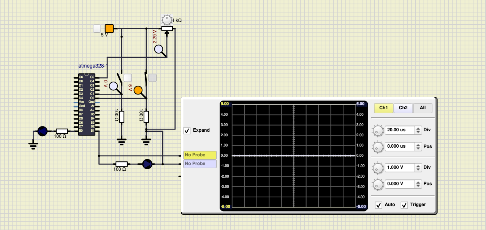
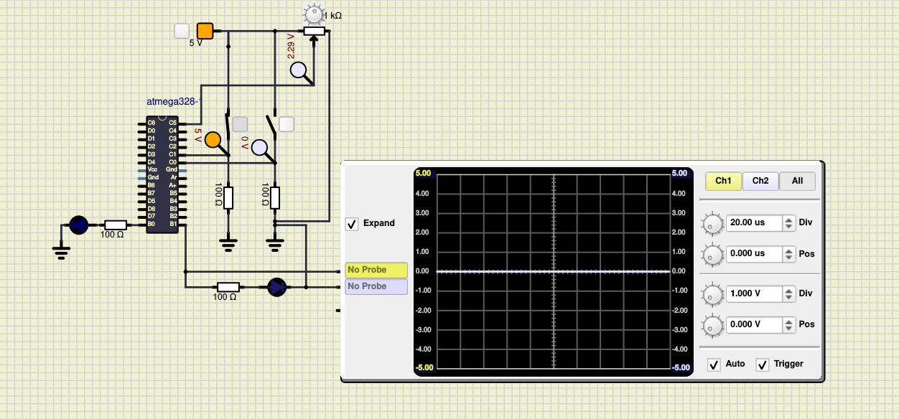

# Embedded C Program 
# LED Actuator

## In Action

### LED Actuator ON when both switches are ON

### LED Actuator OFF when

#### Both switches are OFF

#### Either one of the switches are OFF

#### CI and Code Quality

|Build|Cppcheck|Codacy|
|:--:|:--:|:--:|
||||

