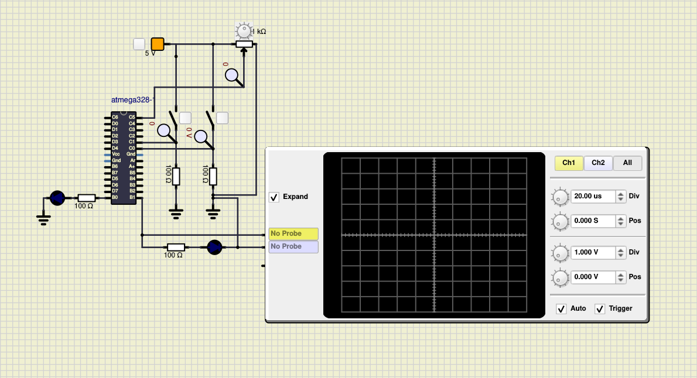
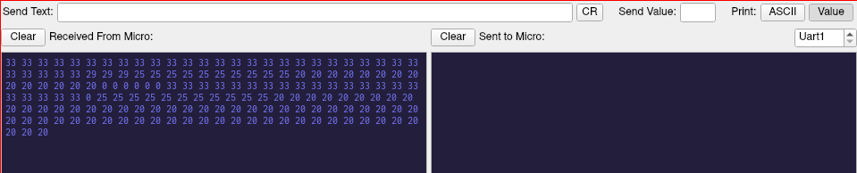

# Car Heater Monitoring Embedded System

## In Action

### LED Actuator that indicates the status of the heater and presence of the driver

#### LED glows when both the heater is ON and the driver is seated

#### LED doesn't glow when 

##### The heater is OFF and the driver is not seated

##### Either the heater is not ON or the driver is not present

#### Different frequencies of PWM waves generated depending on the input received by the temperature sensor

##### 20&deg;C - 20% duty cycle

##### 25&deg;C - 40% duty cycle

##### 29&deg;C - 70% duty cycle

##### 33&deg;C - 20% duty cycle

#### Serial Output that prints the current temperature values

#### CI and Code Quality

|Build|Cppcheck|Codacy|
|:--:|:--:|:--:|
||||

